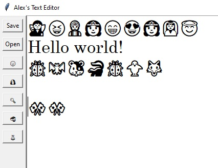

# Text Editor with Emojis

Text Editor with Emojis is a simple and user-friendly text editor implemented in Python using the Tkinter library. This text editor allows users to create, edit, save, and open text files. Additionally, it features emoji insertions to add a touch of fun to your text!



## Features

- **Basic Text Editing:**
  - Create, edit, save, and open text files with ease.

- **Emoji Insertions:**
  - Insert emojis into your text with just a click of a button. Choose from various categories like faces, animals, objects, food, and clothes.

- **Keyboard Shortcuts:**
  - Convenient keyboard shortcuts for quick actions. For example, press `Ctrl+S` to save, `Ctrl+O` to open a file, and more.

## How to Use

1. **Open the Application:**
   - Run the `main()` function to launch the text editor.

2. **Basic Text Editing:**
   - Use the main text area for creating and editing text.

3. **File Operations:**
   - Save: Click the "Save" button or use `Ctrl+S`.
   - Open: Click the "Open" button or use `Ctrl+O`.

4. **Emoji Insertions:**
   - Click the corresponding emoji buttons to insert emojis into your text.

5. **Keyboard Shortcuts:**
   - Utilize keyboard shortcuts for common actions to enhance productivity.

## Dependencies

- [Tkinter](https://docs.python.org/3/library/tkinter.html) (Standard library)
- [Random](https://docs.python.org/3/library/random.html) (Standard library)

## Usage

1. Clone the repository:

   ```bash
   git clone https://github.com/yourusername/text-editor.git
   cd text-editor
   ```
   
2. Run the application:
  
    ```bash
    Copy code
    python your_text_editor.py
    ```

## Customization

Feel free to customize the text editor according to your preferences. Explore the code and add new features or modify the interface as needed.

## License

This project is licensed under the MIT License.

## Acknowledgments

Tkinter for providing a simple and effective way to create graphical user interfaces in Python.
